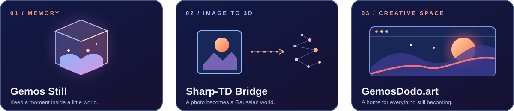

 

**嗨，我是多多 GemosDodo。**  我喜欢把照片、记忆和突发奇想，做成可以走进去的小世界。

*I make little worlds out of images, memories, and curiosity.*

 

[**走进我的网站 ↗**](https://gemosdodo.art)　·　[**体验 Gemos Still ↗**](https://gemosdodo.art/vibecoding-projects/still-memory-box/index.html)　·　[**看看我的代码 ↗**](https://github.com/duoduoaiduoduo?tab=repositories)

 

### ✦ Cosmic check-in / 小宇宙入境处

<strong>你是第</strong>

 

 

<strong>位误入小宇宙的旅人。</strong>

  

猫猫负责记数，你负责随便逛逛。🐾

 

自 2026.09.30 起累计访问 · 重复访问也会计入 · <a href="https://github.com/journey-ad/Moe-Counter">Moe Counter</a>

 

### ✦ Selected worlds / 精选小宇宙

|  |  |
| :-- | :-- |
| **01 · [Gemos Still](https://github.com/duoduoaiduoduo/gemos-still)** | 把记忆装进一个可以探索的 3D 盒子。粒子潮汐、电影感镜头，还有为某一瞬间留住的光。 [在线体验 ↗](https://gemosdodo.art/vibecoding-projects/still-memory-box/index.html) |
| **02 · [Sharp-TD Bridge](https://github.com/duoduoaiduoduo/MLSharp-TD-Bridge)** | 从一张照片到可触摸的高斯世界：让 Apple Sharp 的 3D 生成走进 TouchDesigner。 |
| **03 · [GemosDodo.art](https://github.com/duoduoaiduoduo/gemosdodoweb)** | 我的数字花园，收藏作品、实验、手账，以及那些还在生长的想法。 [打开网站 ↗](https://gemosdodo.art) |

 

`✳︎` &nbsp; **DESIGN × CODE × MEMORY** &nbsp; `✳︎`

我不急着给自己下定义。先继续做有趣的东西。 / Still making things. Still curious.

